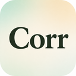
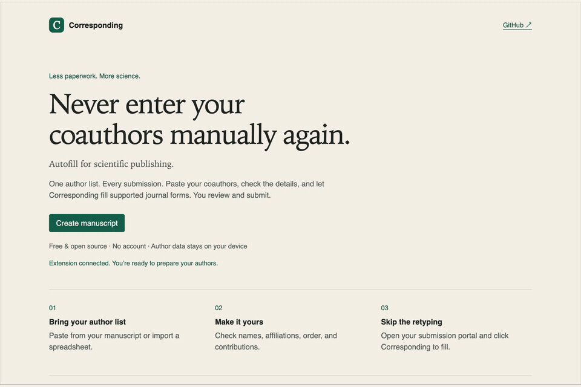
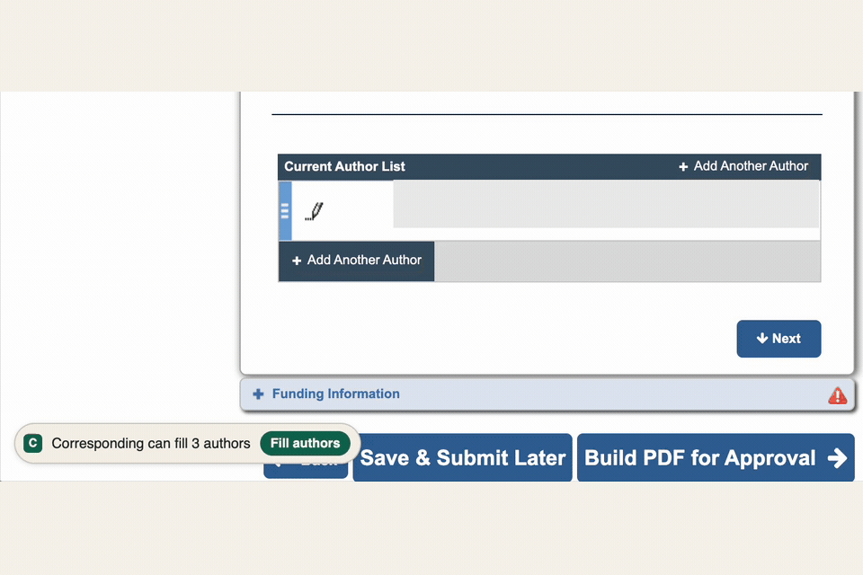
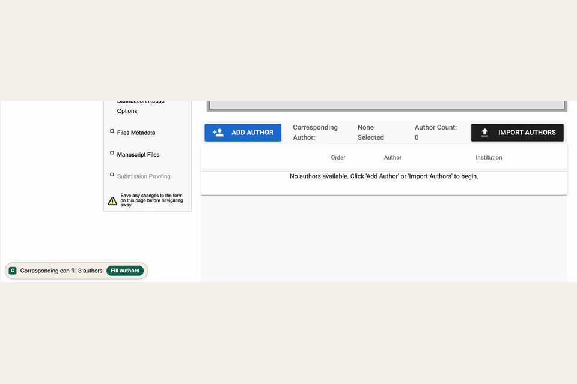

# Corresponding

**Never enter your coauthors manually again.**

Autofill for scientific publishing. Paste your manuscript authors once into the web app, then use the Chrome extension to fill supported journal submission forms.

[](https://github.com/kylekimler/Corresponding/actions/workflows/ci.yml)
[](LICENSE)
[](#install)

[Web app](https://corresponding.pages.dev) · [Install](#install) · [Supported platforms](#supported-platforms) · [Report an issue](https://github.com/kylekimler/Corresponding/issues)

Free and open source, no account needed, author and manuscript information never leaves your computer. 

## See it work

**From your author list to Bioinformatics / ScholarOne**



Institutional verification and CRediT roles still require manual review. [Watch the smoother 60 fps MP4](docs/media/scholarone-workflow.mp4) · [Recording notes](docs/media/README.md)

<details>
<summary>Editorial Manager / PLOS Genetics — fill three coauthors</summary>



[Watch the edited MP4](docs/media/plos-genetics-workflow.mp4) · [Recording notes](docs/media/README.md#editorial-manager--plos-genetics)

</details>

<details>
<summary>bioRxiv — from an empty author list to three authors</summary>



When you use the app you may notice flickering on Biorxiv and other portals that create popups for author filling, see the full mp4 for examples. 

[Watch the continuous MP4](docs/media/biorxiv-workflow.mp4) · [Recording notes](docs/media/README.md#biorxiv)

</details>

## How it works

1. **Prepare your authors.** Paste an author block from your manuscript or google sheet, import a roster from a file, or add authors manually. Check their order, affiliations, emails, ORCIDs, and contributions.
2. **Open your journal.** Once the roster is synced, navigate to a supported submission portal. Click **Fill authors** when Corresponding offers it, or use the extension popup to preview and fill.
3. **Review and submit yourself.** Check the filled information against your manuscript. Corresponding never performs final submission or accepts declarations for you.

Rosters remain editable and reusable. You can download a JSON backup if you need to clear your cache.

## Install

**Pre-release:** the Chrome Web Store listing is awaiting review. Installation currently requires building and loading the extension locally; the web app alone cannot fill journal pages.

With the latest Node.js 22 LTS installed (22.13 or newer):

```sh
git clone https://github.com/kylekimler/Corresponding.git
cd Corresponding
npm ci
npm run build
```

1. Open `chrome://extensions`, enable **Developer mode**, and choose **Load unpacked**.
2. Select the `.output/chrome-mv3` folder in this repository.
3. Run `npm run dev:web` and open `http://localhost:5173` to prepare your roster. Check that the workspace reports successful extension synchronization before filling.

## Try without a journal account

Open the [web app](https://corresponding.pages.dev) and choose **Try a sample roster** to edit six example authors and test local saving. No extension is needed for this preparation step; sample rosters cannot fill live journal pages. A [sample CSV](fixtures/sample-authors.csv) is also available for import practice.

After installing locally, you can use a synthetic author form for Preview → Fill → validation; see the [practice instructions](docs/STORE_HANDOFF.md#reviewer-test-instructions). This is fixture testing, not a live journal submission.

## Supported platforms

| Platform | Evidence and current workflow |
| --- | --- |
| Editorial Manager (PLOS ONE/Genetics) | Capture-backed, automated tests; contextual fill and popup |
| ScholarOne / Manuscript Central (Bioinformatics) | Capture-backed, automated tests; contextual fill and popup |
| bioRxiv / medRxiv | Capture-backed, automated tests; contextual fill and popup |
| Nature Portfolio | Experimental, synthetic-fixture tests; live sites use the popup |
| Cell Press | Not yet |
| Wiley | Not yet |
| Frontiers | Not yet |
| eLife | Not yet |

“Capture-backed” means local tests that use portal HTML are functioning. 

Portal layouts and required fields vary across platforms. Existing non-empty fields are preserved by default; review skipped fields, identity conflicts, author order, and affiliations. If no contextual suggestion appears, try the extension popup's preview. Unsupported forms are not filled automatically.

Missing your journal? [Request support](https://github.com/kylekimler/Corresponding/issues/new?template=add-journal.yml). Please do not attach unredacted author data or private submission pages.

## Privacy and safety

**Where are my authors stored?** Locally in your browser and the extension. Corresponding does not upload names, emails, affiliations, or manuscript rosters to its backend. 

**Does it use AI?** No AI service is used to parse or fill your author information.

**Does anything leave the browser?** The only information Corresponding tracks is an author-count which we use to estimate community time saved. The request body only contains a protocol version and author count. See the [privacy policy](docs/PRIVACY.md) for details, including Google Sheets import.

**Can it submit for me?** No. Filling requires your action. Corresponding does not perform final submission, certification, copyright acceptance, payment, or signatures. 

## Contributing

Bug reports, usability feedback, and redacted portal fixtures are welcome. Start with the [contributing guide](CONTRIBUTING.md); for journal support, see [adding an adapter](docs/ADDING_AN_ADAPTER.md).

Our [public CI checks](https://github.com/kylekimler/Corresponding/actions/workflows/ci.yml) run tests, type checking, linting, both builds, and Chromium fixture journeys. The badge above reports the latest `main` result—not a claim that every live publisher works.

## License and support

Questions or feedback? Email [corresponding.app@gmail.com](mailto:corresponding.app@gmail.com). Please leave out private author or submission information.

[MIT](LICENSE). If Corresponding saves you time, [support its development](https://github.com/sponsors/kylekimler).
