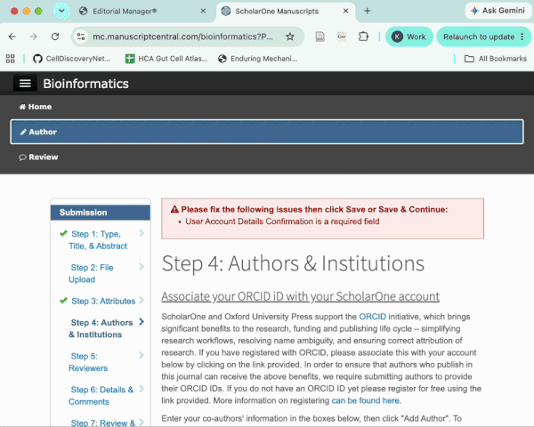

<p align="left">
  
</p>

# Corresponding

**Stop entering author information into journal submission forms by hand.**

Corresponding is a free, open-source Chrome extension that takes the author list you already have and fills journal submission forms for you.

> If you have ever entered 20, 50, or 100+ coauthors one at a time, this is for you.

## See it work

### Editorial Manager / PLOS


### ScholarOne / Bioinformatics



### bioRxiv / medRxiv


## Supported platforms

| Platform | Status |
| --- | --- |
| Nature Portfolio | Supported! |
| bioRxiv / medRxiv | Supported! |
| Editorial Manager | Supported! |
| PLOS | Supported! |
| ScholarOne / Manuscript Central | Supported! |
| Cell Press | Not yet |
| Wiley | Not yet |
| Frontiers | Not yet |
| eLife | Not yet |

**If you would really like your journal supported** [Open an issue](https://github.com/kylekimler/Corresponding/issues/new?template=add-journal.yml)

## How it works

1. Install the Corresponding Chrome Extension
2. Prepare a manuscript roster on [corresponding.app](https://corresponding.app) or in the extension.
3. Open a supported manuscript submission portal as usual.
4. When Corresponding recognizes the author form, click **Fill authors** or **Fill author** — you do not have to open the popup.
5. Or open the extension to preview, import, and fill from there.
6. Review the result.
7. Finish the submission yourself.

## Install

Corresponding is preparing for its first public release. Until the Chrome Web
Store listing is available, you can run it locally:

1. Clone this repository and run `npm ci`, then `npm run build` (Node.js 22+).
2. Open `chrome://extensions`, enable **Developer mode**, and choose **Load unpacked**.
3. Select the `.output/chrome-mv3` folder inside this repository.
4. Run `npm run dev:web` and open `http://localhost:5173` to prepare a roster.

The website discovers the installed extension automatically. No account or
extension ID is required. Reload the extension and refresh open journal tabs
after rebuilding it. Local drafts can be downloaded as JSON backups.

## To contribute a journal yourself:

Many author forms can be described with a small adapter like:

```json
{
  "id": "example-society",
  "label": "Example Society Journal",
  "autofill": true,
  "detect": { "ids": ["author_1_first"] },
  "authors": {
    "slot": "author_{n}_first",
    "fields": {
      "givenName": "author_{n}_first",
      "familyName": "author_{n}_last",
      "email": "author_{n}_email"
    }
  }
}
```

Add the adapter under [`sites/`](https://github.com/kylekimler/Corresponding/tree/main/sites).
Open a Pull Request with your addition.
See [`docs/ADDING_AN_ADAPTER.md`](https://github.com/kylekimler/Corresponding/blob/main/docs/ADDING_AN_ADAPTER.md) for the fixture and adapter workflow.

Again, if you don't want to write code, open an issue and I'll try to add your journal :)

## Data safety

**Corresponding does not collect your information**, 
**Corresponding does not give your information to any AI** (even though it was coded with AI help)

## License

[MIT](https://github.com/kylekimler/Corresponding/blob/main/LICENSE).

### Support Corresponding

If Corresponding saved you some time, you can [leave a tip](https://github.com/sponsors/kylekimler).
