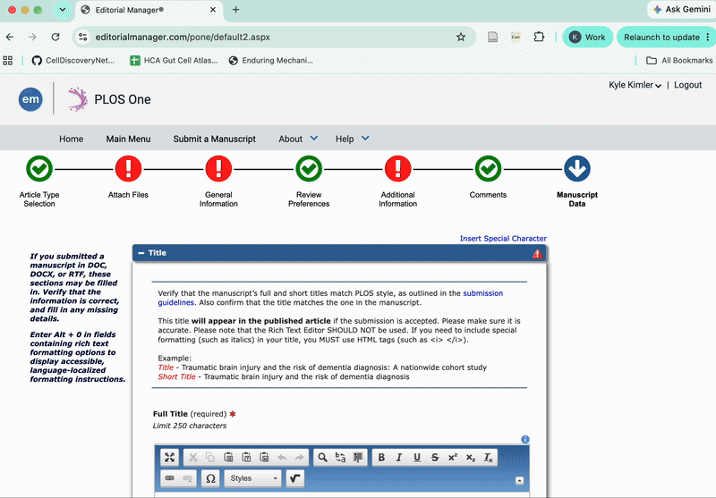
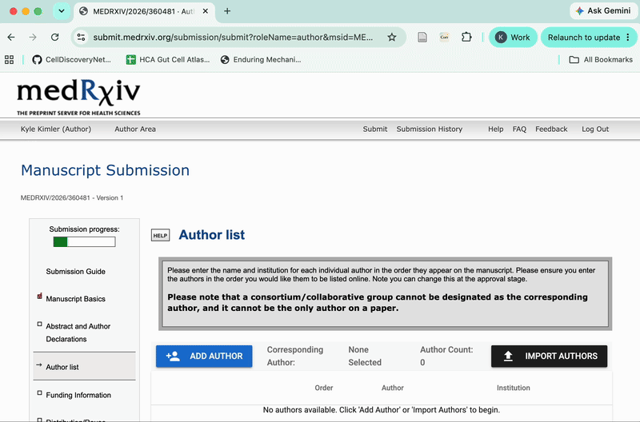

# Corresponding

**Never enter your coauthors manually again.**

Autofill for scientific publishing. Prepare your manuscript authors once in the web app; use the Chrome extension to fill supported journal submission forms.

[](https://github.com/kylekimler/Corresponding/actions/workflows/ci.yml)
[](LICENSE)
[](#install)

[Web app](https://corresponding.app) · [Install](#install) · [Supported platforms](#supported-platforms) · [Report an issue](https://github.com/kylekimler/Corresponding/issues)

Free and open source. No account. Author information stays local.

## See it work

**From your author list to Bioinformatics / ScholarOne**


One roster, no retyping: the local web app syncs three synthetic coauthors to the extension, which adds them to a Bioinformatics test draft in order. Recorded September 11, 2026; edited for length, with private account details redacted. No manuscript was submitted.

Institutional verification and ScholarOne CRediT roles still require manual review. [Watch the MP4](docs/media/scholarone-workflow.mp4) · [Recording notes](docs/media/README.md)

<details>
<summary>Editorial Manager / PLOS ONE — earlier walkthrough</summary>



</details>

<details>
<summary>bioRxiv / medRxiv — earlier walkthrough</summary>



</details>

## How it works

1. **Prepare your authors.** Paste an author block, import a roster, or add authors manually. Check order, affiliations, emails, ORCIDs, and contributions.
2. **Open your journal.** Once the roster is synced, navigate to a supported submission portal. Click **Fill authors** when Corresponding offers it, or use the extension popup to preview and fill.
3. **Review and submit yourself.** Check the filled information against your manuscript. Corresponding never performs final submission or accepts declarations for you.

Your roster remains editable and reusable. Download a JSON backup before switching browsers or clearing local storage.

## Install

**Pre-release:** there is no Chrome Web Store listing yet. Installation currently requires building and loading the extension locally; the web app alone cannot fill journal pages.

With the latest Node.js 22 LTS installed (22.13 or newer):

```sh
git clone https://github.com/kylekimler/Corresponding.git
cd Corresponding
npm ci
npm run build
```

1. Open `chrome://extensions`, enable **Developer mode**, and choose **Load unpacked**.
2. Select the `.output/chrome-mv3` folder in this repository.
3. Run `npm run dev:web` and open `http://localhost:5173` to prepare your roster. Check that the workspace reports successful extension synchronization before filling.

The website discovers the installed extension automatically—no extension ID or account setup. After rebuilding, reload the extension and refresh any open journal tabs.

## Supported platforms

Support is specific to tested author forms, not every journal using a platform.

| Platform | Evidence and current workflow |
| --- | --- |
| Editorial Manager / PLOS ONE | Capture-backed, automated tests; contextual fill and popup |
| ScholarOne / Manuscript Central | Bioinformatics capture-backed, automated tests; contextual fill and popup |
| bioRxiv / medRxiv | Capture-backed, automated tests; contextual fill and popup |
| Nature Portfolio | Experimental, synthetic-fixture tests; live sites use the popup |
| Cell Press | Not yet |
| Wiley | Not yet |
| Frontiers | Not yet |
| eLife | Not yet |

“Capture-backed” means tests use redacted portal HTML. It does **not** mean every live journal configuration has been verified. The ScholarOne demo above confirms one live three-coauthor run, including names, emails, order, and basic affiliations—not completion of every journal requirement. Broader live checks remain necessary; automated CI cannot replace them.

Portal layouts and required fields vary. Existing non-empty fields are preserved by default; review skipped fields, identity conflicts, author order, and affiliations. If no contextual suggestion appears, try the extension popup's preview. Unsupported forms are not filled automatically.

Missing your journal? [Request support](https://github.com/kylekimler/Corresponding/issues/new?template=add-journal.yml). Please do not attach unredacted author data or private submission pages.

## Privacy and safety

**Where are my authors stored?** Locally in your browser and the extension. Corresponding does not upload names, emails, affiliations, or manuscript rosters to its backend. Clearing browser data or removing the extension can remove local data; keep JSON backups.

**Does it use AI?** No AI service is used to parse or fill your author information.

**Does anything leave the browser?** Some fill flows send an author-count-only ping to estimate community time saved. The payload contains a version and count—not names, emails, manuscript content, or page URLs. See the [privacy policy](docs/PRIVACY.md) for details, including Google Sheets import.

**Can it submit for me?** No. Filling requires your action. Corresponding does not perform final submission, certification, copyright acceptance, payment, or signatures.

## Contributing

Bug reports, usability feedback, and redacted portal fixtures are welcome. Start with the [contributing guide](CONTRIBUTING.md); for journal support, see [adding an adapter](docs/ADDING_AN_ADAPTER.md).

Our [public CI checks](https://github.com/kylekimler/Corresponding/actions/workflows/ci.yml) run tests, type checking, linting, both builds, and Chromium fixture journeys. The badge above reports the latest `main` result—not a claim that every live publisher works.

## License and support

[MIT](LICENSE). If Corresponding saves you time, [support its development](https://github.com/sponsors/kylekimler).
